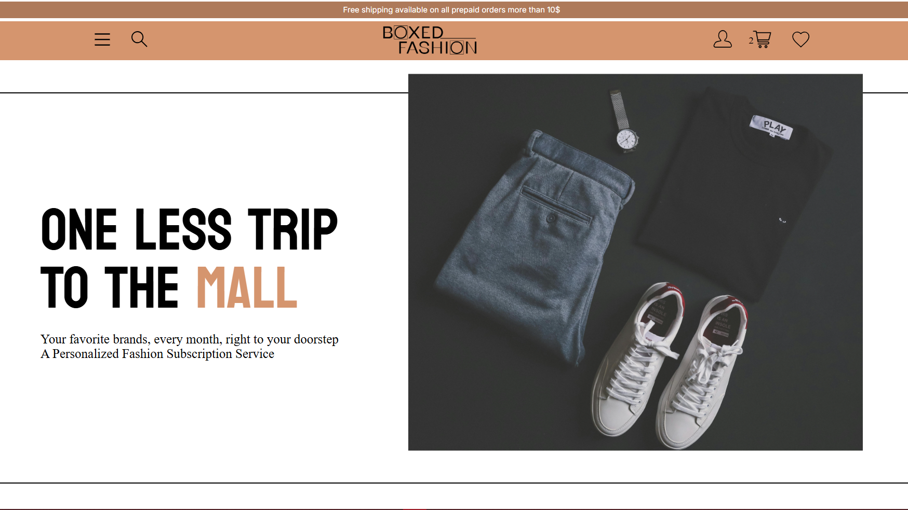

# BoxedFashion.co
#### Personalised outfits at your doorstep, each month! Fashion that defines you. Fashion that expresses you.

Innovative fashion subscription service that connects fashion customers with retailers. The platform offers personalized style recommendations and curated clothing packages based on individual preferences.

## https://boxedfashion.onrender.com



## 🔹 Key features -
1. Personalized style profiles through detailed quizzes
2. Smart outfit suggestions based on user preferences
3. Subscription-based clothing delivery
4. Virtual closet for existing wardrobe items  

Run   
```npm install```    
```pip install -r requirements.txt```   
to install all the dependencies before running the 

## 🔨 Dependencies - 
- nodemon - 3.1.5
- mongoose - 8.7.0
- ejs - 3.1.6
- pymongo - 4.10.1
- requests - 2.7.0
- bcrypt - 5.1.1
- express-session - 1.18.1

## 💻 TechStack used -

- Client-side application
    - Vanilla HTML
    - TailwindCSS
    - MaterialUI
- Server-side application
    - ExpressJS
    - NodeJS
- Endpoint testing
    - Insomnia
- Database system
    - MongoDB
    - PostgreSQL
- Machine learning model
    - Python
        - Numpy
        - Matplotlib
        - Tensorflow
        - Keras
        - SKlearn
- Design Tools
    - Figma
    - Adobe Photoshop
    - Adobe Illustrator
- Text Editor
    - VS Code
    - X Code


## 🏃🏻‍♂️ Run it on your machine!

Make sure you have - 

- Node.js v18+
- npm or pnpm

Download, unzip and open the folder in your text editor.

1. Install the dependencies -
```
>> npm install
```
2. Run the server -
```
>> npm run server
```
3. Open localhost in your brower and Done!

## ⚙ Scripts

Backend server - ```npm run server```

Testing - ```npm run test```

## 📝 License
This project is licensed under the MIT License.

Checkout [Liscence - MIT License. Copyright (c) 2023 Prathmesh Kale.](https://github.com/prathmesh-ka-github/Chessable/blob/main/LICENSE.md) for more info.

## 💛 Appreciation
Give this repo a star! Submit issues if you find bugs! 